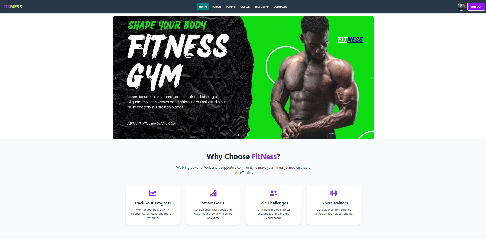
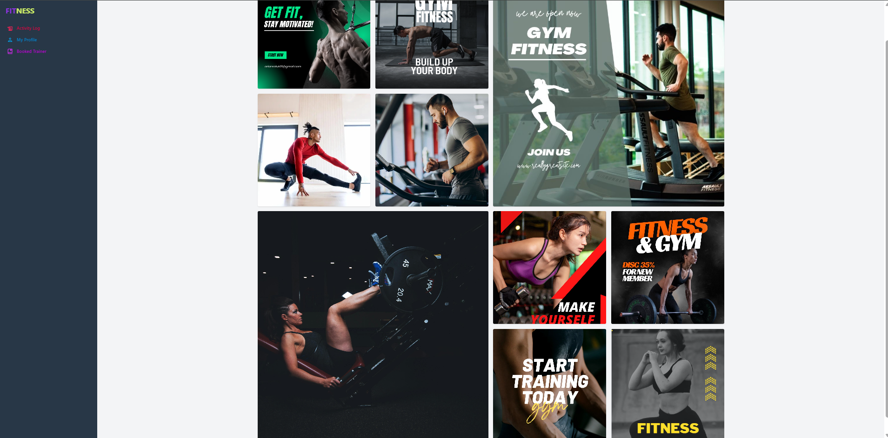
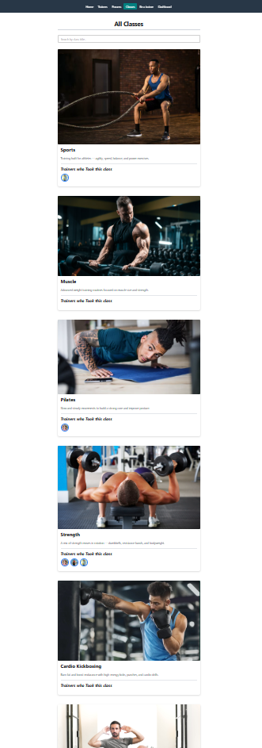
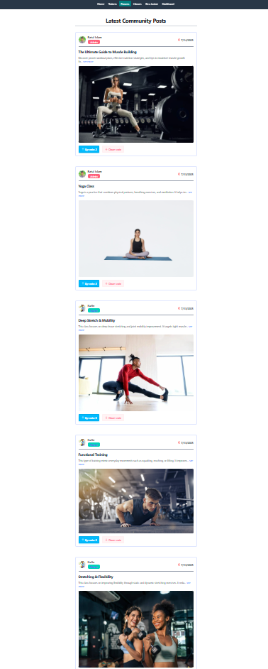

# 🌟 FitNess - Fitness & Training Platform (Client Side)

FitNess is a modern fitness and training platform that allows users to explore fitness classes, book training slots, communicate via forums, and pay securely. Trainers can manage their profiles, add available slots, and track bookings. Admins have full control over the system with analytics and management tools.

---

## 🔗 Live Site

👉 [Live Website](https://whimsical-praline-dd388c.netlify.app/)

## 🚀 Features

- 🧘 Browse and join fitness classes
- 📆 Book training slots with available trainers
- 💬 Forum system for discussion and tips
- ✅ Secure Stripe payment integration
- 👨‍🏫 Role-based dashboard (Admin, Trainer, User)
- 📊 Admin dashboard with analytics and stats
- 🔍 Search and filter trainers or classes
- 📱 Fully responsive UI with mobile support

---

## 🛠 Tech Stack

- **React**
- **React Router DOM**
- **React Hook Form**
- **Tailwind CSS** + **DaisyUI**
- **Axios** + **Custom Secure Axios Hook**
- **Stripe JS** (Payment Gateway)
- **AOS (Animate On Scroll)**
- **SweetAlert2**
- **TanStack Query** + **Axios**

---
---

## 📸 Screenshots

#### 🔹 Banner

## ⚙️ Installation & Running Locally

# Install dependencies
npm install

# Run the development server
npm run dev
