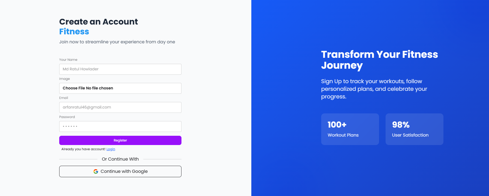

# FitNess - Fitness & Training Platform

FitNess is a modern fitness and training platform that allows users to explore fitness classes, book training slots, communicate via forums, and pay securely. Trainers can manage their profiles, add available slots, and track bookings. Admins have full control over the system with analytics and management tools.

---

## 🚀 Live Demo
🔗 Live Site: https://whimsical-praline-dd388c.netlify.app/

## 🚀 Features

- 🧘 Browse and join fitness classes
- 📆 Book training slots with available trainers
- 💬 Forum system for discussion and tips
- ✅ Secure Stripe payment integration
- 👨‍🏫 Role-based dashboard (Admin, Trainer, User)
- 📊 Admin dashboard with analytics and stats
- 🔍 Search and filter trainers or classes
- 📱 Fully responsive UI with mobile support

---

## 🛠 Tech Stack

### 🌐 Frontend
- **React (v19)** – Modern frontend library
- **React DOM**
- **React Router & React Router DOM (v7)** – Client-side routing
- **Tailwind CSS (v4)** – Utility-first CSS framework
- **DaisyUI** – Tailwind-based component library
- **Framer Motion** – Animations & transitions
- **AOS (Animate On Scroll)** – Scroll-based animations

### 🧩 State & Data Management
- **TanStack React Query** – Server state & data fetching
- **Axios** – HTTP client for API communication
- **Secure Axios Instance** – Protected API requests

### 📝 Forms & Input Handling
- **React Hook Form** – Form handling & validation
- **React Select** – Advanced select inputs

### 💳 Payment Integration
- **Stripe JS**
- **@stripe/react-stripe-js**
- **@stripe/stripe-js**

### 🔐 Authentication & Services
- **Firebase** – Authentication & user management
- **EmailJS** – Client-side email sending

### 📊 Charts & UI Components
- **Recharts**
- **react-chartjs-2**
- **Swiper**
- **React Multi Carousel**
- **React Responsive Carousel**
- **React Icons**
- **Lucide React**
- **Moment.js**

### 🎨 Visual Effects & Loaders
- **tsparticles / react-tsparticles**
- **react-particles**
- **react-spinners**

### 🔔 Notifications & Alerts
- **React Hot Toast**
- **SweetAlert2**

### 🛠 Development Tools
- **Vite** – Fast development & build tool
- **ESLint** – Code linting & quality assurance

---

## 📸 Screenshots

#### 🔹 Home Page

#### 🔹 Register Page

---

# Install dependencies
npm install

# Run the development server
npm run dev

